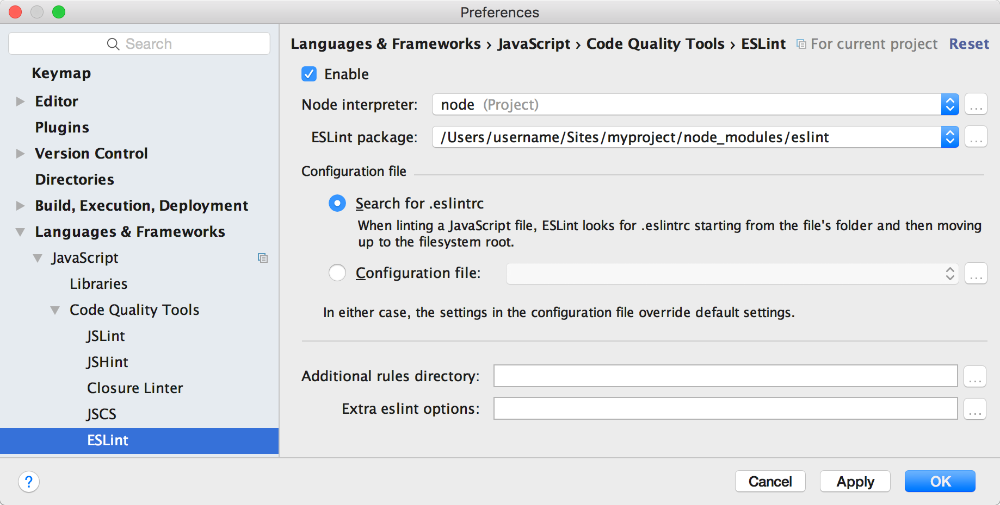

读完这篇文章，你将学到：

1. 为什么有一个统一的编码风格是个好主意
2. 我们推荐哪种 JavaScript 编码风格
3. 怎么样设置 ESLint 来自动检查编码风格
4. 对 Methods、publications 等 Meteor 专有形式的风格建议


<h2 id="benefits-style">统一代码风格的好处</h2>

多年来，在单双引号之争、大括号圣战、缩进之战等各种编码风格问题上，开发者们已经浪费了很长时间。这些问题和代码质量并没有半毛钱关系，但是经常形成很多不同意见，因为一眼就能看到。

虽然在字符串字面量上使用单引号还是双引号并不一定是很重要的，做出一个选择，并在整个团队里使用它是相当有利的。这对 Meteor 和 JavaScript 开发社区也很有利。

<h3 id="easy-to-read">高代码可读性</h3>

就像你不会一个字一个字地读一句话一样，你也不会逐字阅读代码。绝大多数情况下，你只会看一个表达式的长相，或在你编辑器里的高亮情况，来猜测它的作用。如果每坨代码的风格都一样，就能做到每坨看上去一样的代码都 **是** 一样的——没有什么你不希望的隐含意思。这样你就能专注于理解代码背后的逻辑，而不是那些符号。一个例子就是缩进——虽然在 JavaScript 里缩进对于解析来讲意义不是很大，所有代码都统一缩进格式对阅读来讲很有帮助，因为这样你就不必看完所有大括号才能理解到底发生了什么。

```js
// 这段代码有误导性，因为它看上去两个语句都是在 if 里的。
if (condition)
  firstStatement();
  secondStatement();
```

```js
// 清晰多了！
if (condition) {
  firstStatement();
}

secondStatement();
```

<h3 id="automatic-error-checking">自动错误检查</h3>

有个统一的编码风格意味着你可以使用一些标准化的错误检查工具。比如，你和团队约定使用 `let` 和 `const`，不使用 `var`，你就能用个工具来确认所有变量都被约束在你设定的范围内，避免措手不及的变量异常行为。同样地，要求所有变量必须先定义再使用，就能很方便地在运行代码前找出手抖打错的代码。

<h3 id="deeper-understanding">加深理解</h3>

一次性就把一门语言完全学会是很难的。举个栗子，JavaScript 菜鸟经常搞不懂 `var` 和函数作用域。使用一种社区推荐的、有自动代码格式检查的编码风格可以让你避免踩坑。也就是说，你不必学 JavaScript 的那些极端情况就能抄起键盘写代码。

当你写了很多代码，开始撞上你写「推荐的规则」的时候，你可以将它当成是一种学习这个语言和人们使用偏好的机会。

<h2 id="javascript">JavaScript 风格指南</h2>

在 Meteor，综合各种因素，我们坚信 JavaScript 是写 web 应用最好的语言（说的就是你，PHP）。JavaScript 在不断被完善，而 ES2015 及其相关的标准真正团结了 JavaScript 社区。这是当前我们对于在应用中使用 ES2015 JavaScript 的建议。


> 一个将 JavaScript 重构至 ES2015 的例子

<h3 id="ecmascript">使用 `ecmascript` 包</h3>

ECMAScript，所有浏览器的 JavaScript 实现的语言标准，转移到了一种基于年份的发行周期。最新的一份完整标准是 ES2015，里面包含了对 JavaScript 语言很多久等了的、显著的提升。 Meteor 的 `ecmascript` 包通过 [热门的 Babel 编译器](https://babeljs.io/) 将符合这个标准的代码编译成普通的、所有浏览器都能解析的 JavaScript。它与「普通的」JavaScript 完全兼容，所以你不必刻意去采用一些新特性。我们在支持 source maps 等方面花了很多精力，所以你可以直接使用你最喜爱的开发者工具来调试，而不需要去看编译输出。

`ecmascript` 包已经默认地包含在了所有的新应用和新包中，自动编译 `.js` 后缀的文件。参考[所有 ecmascript 包支持的 ES2015 特性](https://docs.meteor.com/packages/ecmascript.html#Supported-ES2015-Features)。

为了获得完整的体验，你应该配合使用同样预置的 `es5-shim` 包。这个包可以让你依赖于 `Array#forEach` 这类功能而不需要担心浏览器是不是支持它。

这个指南里所有的代码范例以及所有未来的 Meteor 教程都会使用 ES2015 里的新特性。你也可以在 Meteor 官方博客上了解并开始使用它：

- [Getting started with ES2015 and Meteor](http://info.meteor.com/blog/es2015-get-started)
- [Set up Sublime Text for ES2015](http://info.meteor.com/blog/set-up-sublime-text-for-meteor-es6-es2015-and-jsx-syntax-and-linting)
- [How much does ES2015 cost?](http://info.meteor.com/blog/how-much-does-es2015-cost)

<h3 id="style-guide">使用一种编码风格方案</h3>

我们建议选择并坚持一种编码风格方案，并且通过工具确立、保证下来。一个我们推荐的流行选择是 [Airbnb style guide](https://github.com/airbnb/javascript) 附加 ES6 扩展（外加可选的 React 扩展）。

<h2 id="eslint">用 ESLint 来检查代码</h2>

「代码格式检查」是自动检查常规错误或编码风格错误的过程。举个例子，ESLint 能判断你是不是打错了变量名，或者一部分代码因为错误的 `if` 条件而永远不会被执行。

我们建议使用 [Airbnb eslint 配置](https://github.com/airbnb/javascript/tree/master/packages/eslint-config-airbnb)，它将验证你的代码是否符合 Airbnb 编码规范。

下面，你可以看到在开发不同阶段设置代码格式检查的方法。一般来说，你会希望格式检查越多越好，因为这是最快又最好的检查错误的方法。

<h3 id="eslint-installing">安装及运行 ESLint</h3>

安装这些 [npm](https://docs.npmjs.com/getting-started/what-is-npm) 包以在你的应用里配置 ESLint：

```
meteor npm install --save-dev eslint-config-airbnb eslint-plugin-import eslint-plugin-meteor eslint-plugin-react eslint-plugin-jsx-a11y eslint
```

> Meteor 自带了一个 npm，所以你可以输入 `meteor npm` 而不需自己安装一个。当然，如果你愿意，可以使用一个全局安装的 npm 来管理包。
> 译注：过高版本的全局 npm 在现在可能引起一定问题。建议使用 `meteor npm`。你也许希望使用一个 npm 镜像，但是 Meteor 自带的尚不支持使用镜像。

你也可以在 `package.json` 中添加 `eslintConfig` 一节来指定你使用 Airbnb 方案，并启用 [ESLint-plugin-Meteor](https://github.com/dferber90/eslint-plugin-meteor)。你还可以配置其他条目，比如添加一个叫 `lint` 的 npm 命令：

```
{
  ...
  "scripts": {
    "lint": "eslint .",
    "pretest": "npm run lint --silent"
  },
  "eslintConfig": {
    "plugins": [
      "meteor"
    ],
    "extends": [
      "airbnb",
      "plugin:meteor/recommended"
    ],
    "rules": {}
  }
}
```

键入以下内容来运行检查器：

```bash
meteor npm run lint
```

如果你在一个 `meteor create myapp` 生成的项目中得到下面这样的错误：

```bash
/opt/www/sites/me/myapp/client/main.js
   1:26  error  Unable to resolve path to module 'meteor/templating'    import/no-unresolved
   2:29  error  Unable to resolve path to module 'meteor/reactive-var'  import/no-unresolved
  18:25  error  Invalid parameter name, use "templateInstance" instead  meteor/eventmap-params

/opt/www/sites/me/myapp/server/main.js
  1:24  error  Unable to resolve path to module 'meteor/meteor'  import/no-unresolved
```

你只要在 `eslintConfig` 的 `rules` 里添加一些东西就能让它闭嘴，像这样：

```
{
  ...
  "eslintConfig": {
   ...
    "rules": {
      "meteor/eventmap-params": [
        2, { "templateInstanceParamName": "instance" }
      ],
      "import/no-unresolved": [
        2, { "ignore": ["^meteor/"] }
      ]
    }
  }
}
```


更多细节请在 ESLint 网站上 [Getting Started](http://eslint.org/docs/user-guide/getting-started) 一节了解。

<h3 id="eslint-editor">与你的编辑器集成</h3>

代码格式检查是找到隐含 bug 的最快途径。检查程序往往比程序本身或者测试跑得还快，所以总是运行它是个好主意。在编辑器里设置检查程序一开始会让你觉得很烦躁，因为它总是揭你的短，但是慢慢地你就会练出肌肉记忆，写出符合规范的代码。下面是在几款编辑器中设置 ESLint 的方法：


<h4 id="eslint-sublime">Sublime Text</h4>

你可以安装 Sublime Text 的一些包来把 ESLint 整合进来。一般来讲，推荐使用 Package Control 来添加这些包。如果你有了 Package Control，直接输入他们的名字就能安装了，不然就戳安装说明：

* Babel （语法高亮 – [完整安装说明](https://github.com/babel/babel-sublime#installation)）
* SublimeLinter （[完整安装说明](http://sublimelinter.readthedocs.org/en/latest/installation.html)）
* SublimeLinter-contrib-eslint （[完整安装说明](https://github.com/roadhump/SublimeLinter-eslint#plugin-installation)）

要设置正确的代码高亮，打开一个 .js 文件，在 *View* 菜单里选择： *Syntax* -> *Open all with current extension as...* -> *Babel* -> *JavaScript (Babel)*。如果你在使用 React .jsx 文件，对一个 .jsx 文件也这样做。搞定了，编辑这些文件时你就会在右下角看到「JavaScript (Babel)」。参考[包的  README](https://github.com/babel/babel-sublime) 来了解兼容的配色方案。

Emmet 用户注意下：你可以在 .jsx 文件中用 `ctrl-e` 来展开 HTML 缩写，并且它也能正确对应 React 的「className」属性。你可以把展开绑回 Tab 键上，但是[你可能不想这样做](https://github.com/sergeche/emmet-sublime/issues/548)。

<h4 id="eslint-atom">Atom</h4>

在 Atom 上安装 ESLint 很简单，只要安装这些包就好了：

```bash
apm install language-babel
apm install linter
apm install linter-eslint
```

然后 **重启** （或者按下 Ctrl+Alt+R / Cmd+Opt+R 来 **重载**） Atom 来激活它。


<h4 id="eslint-webstorm">WebStorm</h4>

WebStorm 提供了[这些关于使用 ESLint 的指引](https://www.jetbrains.com/webstorm/help/eslint.html)。 在你装好 ESLint Node 包并配置好 `package.json`之后，直接启用 ESLint 并点击「Apply」。你可以设置 WebStorm 寻找你 `.eslintrc` 文件的位置，但在笔者的机器上它直接正常工作了。它也会自动建议切换到「JSX Harmony」代码高亮方案。



代码格式检查在 WebStorm 中可以针对单个项目设定，或者你可以在 Editor > Inspections 中把它设为默认，只要选中 Default 配置方案，选中「ESLint」并应用。

<h4 id="eslint-vscode">Visual Studio Code</h4>

在 VS Code 中使用 ESLint 需要安装一个第三方扩展 [ESLint](https://marketplace.visualstudio.com/items?itemName=dbaeumer.vscode-eslint)。按照以下的步骤安装：

1. 运行 VS Code 并按 `Ctrl+P` 来打开 Quick Open 菜单
2. 在命令窗口输入 `ext install vscode-eslint` 并按回车
3. 重启 VS Code


<h2 id="meteor-features">Meteor 编码风格</h2>

上面几节的内容适合于一般的 JavaScript 代码——你可以在任何 JavaScript 应用中使用它们，不仅仅是 Meteor 应用。然而，有很多 Meteor 限定的风格问题，特别是在不同组件的命名和构造问题上。

<h3 id="collections">数据集</h3>

数据集应该用一个复数形式的名词命名，使用 [帕斯卡命名方法](https://en.wikipedia.org/wiki/PascalCase)（即每个单词首字母大写）。数据库中数据集的名字（也就是数据集构造器 `Mongo.Collection` 的第一个参数）应该和变量名一样。

```js
// 定义一个数据集
Lists = new Mongo.Collection('Lists');
```

数据库字段名应该要采用驼峰法命名（camelCase），就像你的变量名那样。

```js
// 插入一个文档，其中字段名使用驼峰命名。
Widgets.insert({
  myFieldName: 'Hello, world!',
  otherFieldName: 'Goodbye.'
});
```

<h3 id="methods-and-publications">方法与 publications</h3>

方法和 publication 应该要用驼峰命名，并且放在它所在的模块的命名空间里（用 `.` 隔开）。

```js
// 在 imports/api/todos/methods.js 中
updateText = new ValidatedMethod({
  name: 'todos.updateText',
  // ...
});
```

注意一下，上面这个例子用了 [在「方法」一章里推荐的 ValidatedMethod](methods.html#validated-method)。如果你没在用这个包，你可以把这个名字当成一个属性名，包在一个对象里传给 `Meteor.methods`。

这种命名方法也适用于一个 publication：

```js
// 命名一个 publication
Meteor.publish('lists.public', function listsPublic() {
  // ...
});
```

<h3 id="files-and-exports">文件、导出与包</h3>

你应当使用 ES2015 `import` 及 `export` 特性来管理代码。这会让你明晰你各部分代码间的依赖关系，阅读代码时也会容易找到所依赖的代码。

你应用中每一个文件应该代表一个逻辑上的模块。避免搞一个无所不包的工具模块，因为它会导出一大坨之间毫无逻辑关联的函数和符号。通常情况下，这意味着一个文件中只包含一个类、一个 UI 组件或是一个数据集，但是也可以有例外，比如说你写了一个 UI 组件，里面有一大堆在这个文件外面都不用的小组件。

当一个文件只包含一个类或一个 UI 组件的时候，它的文件名就该是它所定义的那个东西，包括大小写拼法。所以如果你有个导出一个类的文件：

```js
export default class ClickCounter { ... }
```

它就该叫 `ClickCounter.js`。这样当你导入它的时候，它就会长成这样：

```js
import ClickCounter from './ClickCounter.js';
```

注意导入时使用了相对路径，在文件名后也包含了后缀。

对于 [Atmosphere 包](using-packages.html)，鉴于 1.3 前的旧 API `api.export` 允许多重导出，所以它们没有默认的导出，需要采用解构赋值：

```js
// 要在这里使用解构，因为 Meteor 可能导出多个符号
import { Meteor } from 'meteor/meteor';

// 这样会挂
import Meteor from 'meteor/meteor';
```

<h3 id="templates-and-components">模板和组件</h3>

由于 Spacebars 模板总是全局的，不能以模块的形式导入导出，并且在整个应用中需要有独一无二的名字，我们建议 Blaze 模板用到命名空间的完整路径来命名，用下划线隔开。下划线是个好选择，因为这样，你能轻松地像键入一个 JavaScript 符号那样键入一个模板名。

```html
<template name="Lists_show">
  ...
</template>
```

如果这个模板是个「智能」组件，从服务器加载数据并且和路由搭边，在它的名字后加 `_page`：

```html
<template name="Lists_show_page">
  ...
</template>
```

一般如果你开发一个 UI 组件，你会同时得到几个文件，比如两个或以上的 HTML、CSS 和 JavaScript 文件。在这种情况下，我们建议把它们丢到同一个文件夹，取一样的名字：

```
# 来自 Todos 示范应用的 Lists_show 模板有三个文件：
show.html
show.js
show.less
```

整个目录或路径应该能反映这是和 `Lists` 模块相关的模板，所以在文件名中不必重复这些信息了。在[这里](structure.html#javascript-structure)你可以读到有关目录结构的内容。

如果你在用 React 写 UI，大可不必用这种方式来命名，因为你能直接利用模块系统导入和导出。
