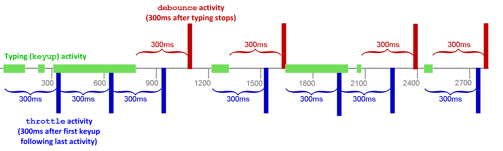

读完本章后，你将学到：

1. 如何使用任意用户界面框架来构建可复用的客户端组件。
2. 如何构建样式指南来帮助你可视化地测试这些可复用组件。
3. 如何在 Meteor 中高效地构建高性能组件。
4. 如何构建可维护、可扩展的用户组建。
5. 如何构建可适配于不同数据源的组件。
6. 如何使用动画来让用户可以时刻感知变化。

<h2 id="view-layers">视图层</h2>

Meteor 官方支持三种用户界面 （UI） 渲染库：[Blaze](blaze.html)、[React](react.html) 和 [Angular](http://www.angular-meteor.com)。Blaze 是 Meteor 于 2011 年发布的时候，作为其中一个部分创造出来的。React 由 Facebook 于 2013 年创造。而 Angular 则是由 Google 于 2010 年创造。他们都已经被成功应用于大型产品级应用中。Blaze 是其中最易学的，并且拥有最多的 Meteor 全栈包，但 React 和 Angular 则发展得更加健全，并且拥有更大的社区。

<h3 id="syntax">语法</h3>

- Blaze 易于学习。它使用了一种类似于 [Handlebars](http://handlebarsjs.com) 的模板语法，在你的 HTML 文件中到处使用诸如 `{{#if}}` 和 `{{#each}}` 等逻辑代码，而模板函数和基于 CSS 选择器的事件映射则被写在配套的 JavaScript 文件中。
- React 使用 [JSX](https://facebook.github.io/react/docs/jsx-in-depth.html) 语法，让你可以使用 JavaScript 来编写 HTML 代码。虽然它没有像其他库那样对逻辑和视图进行分离，但它却拥有最强的灵活性。模板函数和事件处理器作为 HTML 的一部分被定义在相同的文件中，这让读者非常容易理解组件的各部分是如何被组织在一起的。
- Angular 则在 HTML 中使用[特殊的属性语法](https://angular.io/docs/ts/latest/guide/cheatsheet.html)来处理逻辑和事件。模板辅助函数和相关事件被写在对应的 JavaScript 文件中，然后用户可以在 HTML 属性中通过名字来调用它们。
- React 和 Angular 强调了一种更好的组件结构，这使得开发大型应用更加容易。（当然，你也可以[按照约定](blaze.html#reusable-components)，或使用  [Blaze Components](http://components.meteorapp.com/) 或 [ViewModel](https://viewmodel.org/) 等包来以组件化的方式进行 Blaze 开发。

<h3 id="community">社区</h3>

- Blaze 在 Atmosphere 上拥有许多 Meteor 全栈包，例如 [`useraccounts:core`](https://atmospherejs.com/useraccounts/core) 和 [`aldeed:autoform`](https://atmospherejs.com/aldeed/autoform)。
- React 在 Github 上有 4.2 万个 stars，在 npm 上有 1.3 万个包。
- Angluar 在 Github 上有 1.2 万个 stars，在 npm 上有 4 千个包。

> 译注：在 Github 上，用户可以为不同的项目点亮 star 以表示喜欢或支持，因此，stars 数量越高，代表这个项目越受欢迎。作为对比参考，Meteor 现在有 3.4 万个 stars，而 Bootstrap 有 9.7 万个 stars。

<h3 id="performance">性能</h3>

- 解决方案不同，渲染性能也是大相径庭。上述所有三种库在渲染简单应用时都非常快速，但在渲染更加复杂的应用时，他们可能会耗费较多时间。
- Angular 和 React 相比于 Blaze 做了更多性能优化工作，因此在通常情况下他们表现得更高。然而，在某些情况下，Blaze 则做得更好（例如在一个变化的游标上使用 `{{#each}}`）。
- 根据一份 [跑分调查](http://info.meteor.com/blog/comparing-performance-of-blaze-react-angular-meteor-and-angular-2-with-meteor) 显示，目前的排名从高到低依次是：Angular2 > React > Angular1 > Blaze。

<h3 id="mobile">移动应用</h3>

- **Cordova**
  - 所有三种库都可以在 Cordova 网页视图中良好运作，因此，你可以选择其中任意一个库并配套使用其它移动 CSS 库，例如 Ionic。
  - 目前最先进的移动网页框架是 [Ionic 2](http://ionicframework.com/docs/v2/)，它使用 Angular 2。
  - Ionic 1 使用 Angular 1， 但这里同样有 [Blaze](http://meteoric-doc.com/) 和 [React](http://reactionic.github.io/) 的移植版。
  - 如果你使用 React，目前最流行的 React 移动网页框架是 [Reapp](http://reapp.io/)。
- **原生应用**
  - 任何原生 iOS 或 Android 应用都可以通过 [DDP](https://www.meteor.com/ddp) 和一个 Meteor 服务器进行连接。对于 iOS 应用， 你可以使用 [`meteor-ios`](https://github.com/martijnwalraven/meteor-ios) 框架。
  - 你可以使用 [React Native](https://facebook.github.io/react-native/) 来以 JavaScript 编写原生客户端应用。想了解更多关于如何在 Meteor 中使用 React Native，参考[这里](https://github.com/spencercarli/react-native-meteor-index)。

<h2 id="components">UI 组件</h2>

无论你使用什么视图层，这里有一些模式可以帮助你构建易于理解、测试和维护的用户界面。如同模块化等通用模式，这些模式旨在使你的 UI 元素的接口更加清晰并且避免使用那些会绕开这些已知接口的技术。

在这篇文章中，我们把你的用户界面中的元素称为「组件」。虽然在某些系统中，你可能把它们称为「模板」，但你最好把它们看作某种更加类似于组件的东西，因为它们有 API 和内部逻辑，而不像模板那样只有一大堆 HTML。

那么首先，我们先思考一下两种非常有用的组件分类，「可复用」和「智能」：

<h3 id="reusable-components">可复用组件</h3>

一个「可复用」的组件是这样一个组件，它在渲染时不依赖任何外部环境，仅依赖直接输入（Blaze 中的*模板参数*或 React 中的 *props* ）和内部状态进行渲染。

特别地，在 Meteor 应用中，这意味着一个组件不会从全局数据源中直接获取数据——例如数据集（Collections）、数据囤（Stores）、路由器（routers）、用户数据（user data）或其他类似的地方。例如，在 Todos 示例应用中，`Lists_show` 模板从参数接收要渲染的 list 和这个 list 中的 todos，而并没有直接去 `Todos` 或 `Lists` 数据集中进行查询。

可复用组件用许多优势：

 1. 容易理解——你不需要了解数据在全局数据囤中如何变化，只需要知道组件参数如何变化就可以了。
 
 2. 容易测试——你不需要在意他们的渲染环境，只需要提供正确的参数即可。
 
 3. 容易构建样式指南——正如我们即将在[「组件样式指南」章节](#styleguides)中看到那样，在创建样式指南时，一个纯净的环境将极大地简化我们的工作。

 4. 在不同的环境中，你能够很确切地知道你需要向它们提供什么依赖。

 这里还有一种更加严格的可复用组件——「纯」组件——它没有任何内部状态。例如，在 Todos 应用中，`Todos_item` 模板仅仅根据它的参数来决定如何进行渲染。纯组件比起其它可复用组件更加容易理解和测试，因此在可能的情况下，尽量使用纯组件。 

<h3 id="global-stores">全局数据囤</h3>

那么，哪些是你应该在可复用组件中避免使用的全局数据囤呢？的确有那么一些。Meteor 是为应用开发速度进行优化的，因此，你可以全局地访问许多东西。这对于构建「智能」组件（下面会说到）是十分方便的，然而，你需要在可复用组件中避免使用这些数据源：

- 你的数据集，包括 `Meteor.users`,
- 账户信息，例如 `Meteor.user()` 和 `Meteor.loggingIn（）`
- 当前路由信息
- 其他类型的客户端数据囤（更多请参考[「数据加载」章节](data-loading.html#stores)）

<h3 id="smart-components">智能组件</h3>

虽然，应用中的绝大部分组件应该是可复用的，但仍需要有某种方式将数据传给他们。这正是「智能组件」的职责所在。这些组件通常负责以下事情：

1. 订阅数据
2. 从这些 subscriptions 中获取数据
3. 从数据囤中获取全局客户端状态——例如路由器、账户系统以及你自己的数据或状态中心

理想情况下，一个智能组件一旦汇集好了所需数据，就将它们传递给可复用子组件来进行渲染。除了一个或多个可复用子组件，智能组件通常不会渲染其他东西。这使得你能够很容易地在测试中分离渲染和数据加载。

一个典型的智能组件就是「页面」组件。当你访问一个 URL 时，路由器就会将你引导向一个页面组件。这个组件通常会做上述三种事情并将结果作为参数传递给子组件。在 Todos 示例应用中，`listShowPage` 正是这样一个组件，它的 HTML 模板非常简单：

```html
<template name="Lists_show_page">
  {{#each listId in listIdArray}}
    {{> Lists_show (listArgs listId)}}
  {{else}}
    {{> App_notFound}}
  {{/each}}
</template>
```

它的 JavaScript 负责订阅和获取哪些需要被 `Lists_show` 模板使用的数据：

```js
Template.Lists_show_page.onCreated(function() {
  this.getListId = () => FlowRouter.getParam('_id');

  this.autorun(() => {
    this.subscribe('todos.inList', this.getListId());
  });
});

Template.Lists_show_page.helpers({
  // 我们在只有一项的数组中使用 #each，因此，当lists发生改变时，「list」模板会被删除，
  // 而一个新的副本将被添加，这对于我们需要的动画来说非常重要。
  listIdArray() {
    const instance = Template.instance();
    const listId = instance.getListId();
    return Lists.findOne(listId) ? [listId] : [];
  },
  listArgs(listId) {
    const instance = Template.instance();
    return {
      todosReady: instance.subscriptionsReady(),
      // 为了对数据响应进行控制，我们将「list」（它包含了整个 list 以及所有的字段）作为一个函数
      // 进行传递。当你勾选一个 todo 项时，`list.incompleteCount` 将会改变。如果我们不这样做，
      // 无论你勾选了哪一项，整个 list 都会重新渲染。通过将 list 的数据响应隔离在关注它的区域，
      // 我们可以阻止这样的事发生。
      list() {
        return Lists.findOne(listId);
      },
      // 由于在查询 list 时只设置了 `_id` 字段，我们没有建立对 `list.incompleteCount` 的依赖，
      // 因此避免了在它发生改变时重新渲染整个 todos
      todos: Lists.findOne(listId, {fields: {_id: true}}).todos()
    };
  }
});
```

<h2 id="styleguides">可视化地测试可复用组件</h2>

可复用组件的一个好处是，你可以在任何地方渲染他们，因为他们不依赖复杂的环境。当它们被用在组件展列、调试应用时，这一点就非常有用了。在这些应用中，你可以展列、可视化和测试你的 UI 组件。


一个组件展列器会做两件事情：

1. <b>展列</b>你的应用组件以便能轻易地找到他们。
2. 使用开发者定义的状态和伪数据来<b>渲染</b>这些组件。

例如，在 Galaxy 中，我们使用一个被称作 Chromatic 的组件展列器来一次一个或一次全部的形式来渲染组件。

<iframe width="560" height="315" src="https://www.youtube.com/embed/SRXvg-_Suo0" frameborder="0" allowfullscreen></iframe>

Chromatic 帮助我们快速构建复杂组件。通常，在一个大型应用中，仅仅通过「使用」这个应用的方式，我们很难到达一个组件的特定状态。例如，当两个相同的应用同时被部署并运行时，Galaxy 中的一个组件可进入一个复杂的状态。使用 Chromatic，我们可以在组件级别定义这种状态并独立于应用逻辑对它进行测试。

输入 `meteor add mdg:chromatic`，你便可以在你的 Meteor + React 应用中使用 [Chromatic component explorer](https://github.com/meteor/chromatic)。使用 React 构建的类似项目包括 Phil Cockfield 的 [UI Harness](http://www.uiharness.com/) 和 Arunoda Susiripala 的 [React Storybook](https://github.com/kadirahq/react-storybook)。

<h2 id="ui-patterns">用户界面模式</h2>

在构建 Meteor 应用的用户界面时，有一些模式非常有用。

<h3 id="i18n">使用「tapi18n」进行国际化</h3>

国际化（i18n）是一种构建 UI 的过程，它使你能够很容易地将应用中的所有文字替换为其他语言。在 Meteor 中，[超棒的 `tap:i18n` 包](https://atmospherejs.com/tap/i18n)提供了一系列 API 来帮助你构建各种翻译将其应用于你的组件和前端代码之中。

<h4 id="places-to-i18n">需要翻译的地方</h4>

最好仔细思考一下，在你的系统中哪些地方有用户可读的字符串，并确保你是在合理地使用 i18n 来生成这些字符串。在这一节中，我们会大致看到如何在不同的地方使用 [`tap:i18n`](#tap-i18n-js) 进行具体处理。

1. **HTML 模板。**UI 组件中用户可见的所有内容——这是最明显的地方。
2. **客户端 JavaScript 消息。**通知或其他在客户端生成并展示给用户的消息，都应当被翻译。
3. **服务端 JavaScript 消息和电子邮件。**服务端生成的消息或错误有时经常被用户看到。显而易见之处包括电子邮件和其他服务端生成的消息，例如移动推送通知。但微妙之处在于如何对方法调用的返回值和错误消息进行处理。错误通常都以一种更加通用的形式在连接上传递，并在到达客户端后才被翻译。
4. **数据库中的数据。**另一个你可能想进行翻译的地方是数据库中那些用户实际产生的数据。例如，如果你在运行一个 wiki 应用，你可能想有一种机制让 wiki 页面能够被翻译成各种语言。如果实现这一点得根据你应用的具体情况来确定。

<h4 id="tap-i18n-js">在 JavaScript 中使用 `tap:i18n`</h4>

通过 `meteor add tap:i18n` 在你的应用中安装 `tap:i18n` 之后，你便可以使用它。然后，我们需要为我们的默认语言（`en` 即英语）添加一个 JSON 翻译文件——我们可以将它放在 `i18n/en.i18n.json`。一旦我们完成这些，我们便可以在 JavaScript 代码中导入并使用 `TAPi18n.__()` 函数来获取字符串或键的翻译。

例如，对于 Todos 示例应用中的错误，我们就创建了一个 `errors` 模块，对于所有可能在方法中被抛出的错误，它让我们能够很容易地 alert 一个经过翻译的版本：

```js
import { TAPi18n } from 'meteor/tap:i18n';

export const displayError = (error) =>  {
  if (error) {
    // 这里其实最好不要 alert 这个错误，而应该用某种更加巧妙的方式提示用户
    alert(TAPi18n.__(error.error));
  }
};
```

`error.error` 字段是 `Meteor.Error` 构造函数的第一个参数，我们可以使用它在应用中唯一确定所有错误。然后，我们可以在 `i18n/en.i18n.json` 中定义这些错误的英文版本：

```json
{
    "lists": {
    "makePrivate": {
      "notLoggedIn": "Must be logged in to make private lists.",
      "lastPublicList": "Cannot make the last public list private."
    },
    "makePublic": {
    ...
    }
    ...
}
```

<h4 id="tap-i18n-blaze">在 Blaze 中使用 `tap:i18n`</h4>

我们也可以很容易地在 Blaze 模板中使用各种翻译。为了做到这一点，我们可以使用 `{{_ }}` helper。在 Todos 应用中，我们使用希望输出的实际英文字符串作为 i18n 的键，这意味着我们不需要提供一个英文翻译版本，虽然在现实应用中你最好一开始就准备好这些键。

例如，在 `app-not-found.html` 文件中：

```html
<template name="App_notFound">
  <div class="page not-found">
    <nav>
      <div class="nav-group">
        <a href="#" class="js-menu nav-item"><span class="icon-list-unordered"></span></a>
      </div>
    </nav>

    <div class="content-scrollable">
      <div class="wrapper-message">
        <div class="title-message">{{_ 'Page not found'}}</div>
      </div>
    </div>
  </div>
</template>
```

<h4 id="tap-i18n-changing-language">改变语言</h4>

你可以调用 `TAPi18n.setLanguage(fn)` 来改变语言。 `fn` 是一个（可能是响应式的）函数，它返回当前语言。例如，你可以这样写

```js
// 一个用于表示当前语言的数据囤
export const CurrentLanguage = new ReactiveVar('en');


import CurrentLanguage from '../stores/current-language.js';
TAPi18n.setLanguage(() => {
  CurrentLanguage.get();
});
```

然后，在你的 UI 中的某个地方，如果用户选择了一个语言，你可以 `CurrentLanguage.set('es')`

<h3 id="event-handling">事件处理</h3>

你的 UI 中很大一部分都参与响应用户事件，你应当采取一些措施来保证应用在面对用户的快速输入时不会拖后腿。应用在响应用户行为时产生卡顿是最显著的性能问题之一。

<h4 id="throttling-method-calls">限制用户行为产生的方法调用频率</h4>

通常，用户行为会或多或少导致数据库中的数据产生变化。然而，你千万不能过于频繁地造成数据变化。例如，如果你想在用户输入文字时立刻保存这些文字，你应当确保每次方法调用之间至少间隔几百毫秒。

如果你不这样做，你将遭遇全面的性能崩溃：用户的网络连接中将泛滥着海量的微小数据变动信息，你的 UI 会在你每一次敲击键盘时进行更新，这不仅可能会导致客户端性能下降，还会使你的数据库承受过多的写操作。
> 译注：对于大部分数据库来说，写操作相对于读操作来说都更加复杂，且性能开销更大。如果数据库承受了过多的写操作，可能影响整个数据库的性能，进而导致该应用上的所有用户体验下降，甚者无法响应。

为了限制写操作，一个常用的方式是使用 underscore 的 [`.throttle()`](http://underscorejs.org/#throttle) 或 [`.debounce()`](http://underscorejs.org/#debounce) 函数。例如，在 Todos 示例应用中，我们将用户输入产生写操作的频率限制在每次间隔 300ms：

```js
import {
  updateText,
} from '../../api/todos/methods.js';


Template.Todos_item.events({
  // 当用户输入时更新 item 上的文字，但是限制这个事件的发生频率以确保我们不会向
  // 服务器滥发更新请求（至少每隔 300ms 才能发送一次）
  'keyup input[type=text]': _.throttle(function(event) {
    updateText.call({
      todoId: this.todo._id,
      newText: event.target.value
    }, (err) => {
      err && alert(err.error);
    });
  }, 300)
});
```

通常，如果你不介意用户在执行一系列动作的过程中就产生相应的伴随事件（例如，在本例中，如果你不介意用户还没有停止输入，更新请求就在不断产生），使用 `.throttle()` 就好了。否则，你可以使用 `.debounce()` 函数，这样的话，只有在用户停止输入超过 300ms 之后，更新事件才会触发。



<h4 id="limiting-re-rendering">限制重新渲染</h4>

用户每一次输入时，即使你不打算向数据库保存一次数据，有时你仍然希望在内存数据囤里更新一下数据。如果更新这个数据囤会造成很多 UI 改变，当你过于频繁地更新它时，你会感受到糟糕的体验并丢失输入。在这种情况下，你可以像我们上面限制方法调用一样，通过 `.throttle` 限制 UI 重新渲染。你也可以使用 `.debounce()` 来确保当用户停止输入时才触发改变。

<h2 id="ux-patterns">用户体验模式</h2>

用户体验，简称 UX（User Experience），指用户与应用交互时的体验与感受。这里有一些 Meteor 应用的经典 UX 模式值得我们一探究竟。这其中有很多模式与用户与应用交互时的数据加载方式密切相关，因此，在我们的[「数据加载」章节](data-loading.html#patterns)中有许多类似类似的小节描述了如何使用 Meteor 的 publications 和 subscriptions 来实现这些模式。

<h3 id="subscription-readiness">订阅就绪</h3>

当你在 Meteor 中订阅数据时，这些数据总不能一下子就变到客户端了。通常，在数据到达前，根据网络状况的不同，用户可能需要等上几百毫秒甚至几秒钟。当用户第一次打开应用，或在展示完全不同的数据的页面直接切换时，这种等待显得尤为突出。

这里有一些 UX 技巧可以用来处理这种等待间隙。最简单的方法就是，当你在等待数据时（一个页面通常会打开好几个 subscriptions），展示一个通用的「加载中」页面来代替当前页面。例如，在 Todos 实例应用中，我们等待公共 lists 和 用户的私有 lists 加载完毕之后才实际渲染这个页面：

```html
{{#if Template.subscriptionsReady}}
  {{> Template.dynamic template=main}}
{{else}}
  {{> App_loading}}
{{/if}}
```
此处，我们使用 Blaze 的 `Template.subscriptionsReady` 来实现这个效果再适合不过了。它会等到当前组件请求的所有 subscriptions 均准备就绪之后才会变成 true。

<h4 id="per-component-loading">组件级加载状态</h4>

通常，除了那些还在等待数据的区域外，尽快并且尽可能多地展示页面往往会带来比较好的用户体验。因此，这里有一个不错的模式叫做「组件级加载」。我们在 Todos 示例应用中运用了这个模式——当你访问 list 页面时，我们立刻渲染了 list 的基本信息，比如它的标题和可见性设置，然后，当这个 list 的 todos 数据还在加载时，我们用了一个加载状态来占位。


为了实现这一点，我们将 todos 数据的订阅就绪状态从发起订阅的智能组件（`listShowPage`）那里传递给了负责渲染数据的可复用组件：

```html
{{> Lists_show todosReady=Template.subscriptionsReady list=list}}
```

然后，我们便可以根据这个状态来判断应该在可复用组件中渲染什么：
 
 (`listShow`):

```html
{{#if todosReady}}
  {{#with list._id}}
    {{#each todo in (todos this)}}
      {{> Todos_item (todoArgs todo)}}
    {{else}}
      <div class="wrapper-message">
        <div class="title-message">No tasks here</div>
        <div class="subtitle-message">Add new tasks using the field above</div>
      </div>
    {{/each}}
  {{/with}}
{{else}}
    <div class="wrapper-message">
      <div class="title-message">Loading tasks...</div>
    </div>
{{/if}}
```

<h4 id="loading-placeholders">展示占位符</h4>

你可以进一步优化上述 UI：在等待数据加载时，你可以展示一个占位符。这是一个由 Facebook 率先使用的模式，它让用户能更加实在地感受到即将展示的是怎样的内容。如果你让占位符保持和最终内容同样的尺寸，它还能防止数据加载时部分 UI 到处移动。

例如，在 Glalaxy 网站上，当你在等待应用日志加载时，你会看到一个加载状态，它预示了你即将看到的内容：


<h4 id="styleguide-and-loading">使用样式指南来验证加载状态</h4>

由于加载状态是一种暂态，并且在开发环境下，由于 subscriptions 通常瞬时完成，导致我们很难注意到它，因此可视化地处理加载状态通常十分困难。

这也正是为什么我们说，可以到达组件任何状态的[组件样式指南](#styleguides)是一种非常有用的东西。由于我们的可复用组件 `Lists_show` 并不关心 subscription，仅仅根据 `todosReady`参数来决定渲染什么内容，因此，使它在样式指南中展示加载状态是非常容易的。

<h3 id="pagination">分页</h3>

在我们的[「数据加载」章节](data-loading.html#pagination)中，我们讨论了一种通过「无限滚动」订阅来实现的分页模式。当用户滚动到页面底部时，这种订阅便会多加载一页内容。那么，又有哪些 UX 模式被用于使用这些数据并向用户展示进展状况呢？这是一个有趣的问题。

<h4 id="list-component">列表组件</h4>

让我们来思考一下更通用的列表组件。为了有一个具体的例子，我们可以参考 Todos 示例应用中的 todo 列表。虽然现在还不行，但在未来版本的应用中，我们将可以分页浏览任意一列 todos。

这个列表可能进入如下状态：

 1. 刚开始加载，还没有任何数据。
 2. 展示一部分条目，还有更多条目可展示。
 3. 展示一部分条目，还有更多条目正在加载中。
 4. 展示*所有*条目，并且已经没有更多可展示的条目了。
 5. *不*展示任何条目，因为没有可展示的条目。

那么，这样一个组件需要怎样的参数来区分这五种状态呢？让我们考虑一种通用模式，只要我们能提供下列信息，那么它就能良好地工作：

 - `count`——所有条目的总数。
 - `countReady`——一个布尔值用于表示我们是否知道条目总数（注意，条目总数也是我们需要加载的数据）
 - `requested`——我们已请求的条目数。
 - `items`——我们已经获取到的条目。

基于上述条件，我们可以区分当前列表组件处于何种状态：

1. `countReady` 为假，或 `count > 0` 且 `items` 为空。（这实际上是两种状态，但无需在视觉上有所区分） 
2. `items.length === requested && requested < count`
3. `0 < items.length < requested`
4. `items.length === requested && count > 0`
5. `count === 0`

你看，虽然情况有点复杂，但各种状态仍然是完全由参数组合所决定的，因此是完全可测的。一个组件样式指南极大地辅助了我们去方便地观察所有这些状态！在 Galaxy，我们在组件样式指南中展示了每一个应用的每一个状态，因此，我们能够确保他们都能如预期一般工作并正确显示：

<image src="images/galaxy-styleguide-list.png">

<h4 id="pagination-controller">分页「控制器」模式</h4>

列表组件让我们很好地认识到拆分智能组件和可复用组件的好处。我们已经看到，正确地渲染和观察一个列表的所有可能状态不是一件容易的事，但通过使用一个以参数来接收所有必要信息的可复用列表组件，我们可以极大地简化这件事情。

然而，我们还需要去订阅这个列表的条目以及数量，然后在某处获取这些数据。一个合理的方法是使用智能包裹组件（类似于 MVC 中的「控制器」），它的任务就是去订阅并获取相关数据。

在 Todos 示例应用中，我们已经有了一个针对列表的包裹组件，它会与路由器进行沟通并设置 subscriptions。通过简单的扩展，这个组件便可以了解分页情况：

```js
const PAGE_SIZE = 10;

Template.Lists_show_page.onCreated(function() {
  // 我们使用内部状态来保存我们已经请求的条目的数量
  this.state = new ReactiveDict();

  this.getListId = () => FlowRouter.getParam('_id');

  this.autorun(() => {
    // 当 `requested` 状态增涨时，我们重新订阅更多的 todos
    this.subscribe('List.todos', this.getListId(), this.state.get('requested'));
    this.countSub = this.subscribe('Lists.todoCount', this.getListId());
  });
  
  // `onNextPage` 函数用于增涨 `requested` 状态变量。它被传入 listShow 子组件，
  // 在用户到达所有可见的 todos 的，它将被触发
  this.onNextPage = () => {
    this.state.set('requested', this.state.get('requested') + PAGE_SIZE);
  };
});

Template.Lists_show_page.helpers({
  listArgs(listId) {
    const instance = Template.instance();
    const list = Lists.findOne(listId);
    const requested = instance.state.get('requested');
    return {
      list,
      todos: list.todos({}, {limit: requested}),
      requested,
      countReady: instance.countSub.ready(),
      count: Counts.get(`list/todoCount${listId}`),
      onNextPage: instance.onNextPage
    };
  }
});
```

<h4 id="patterns-for-new-data">展示新数据的 UX 模式</h4>

如何让用户注意到新的信息（例如列表中的数据发生变化）？这对于实时系统（例如 Meteor）的开发者来说，是一个既有趣又充满挑战的 UX 问题。正如 [Dominic](http://blog.percolatestudio.com/design/design-for-realtime/) 指出，仅仅尽可能快地更新内容可能不是一个好办法，因为这可能让用户忽略掉内容变化，或困惑于到底发生了什么。

一个解决方案是为列表变化添加*动画效果*（我们将在[动画章节](#animation)中看到），但在某些时候，这可能并不是最好的办法。例如，若用户正在读一系列评论，在他们读完之前，可能根本不想看到任何变化。

在这种情况下，我们也可以在不更新主视 UI，仅仅告知用户这里有了新的变化。然而，在 Meteor 这样默认实时的系统里，要阻止数据变化对 UI 产生影响并不容易。

感谢智能组件与可复用组件的分离，现在要做到这一点是可能的。由于可复用组件仅仅渲染它得到的数据，因此我们可以让智能组件来控制哪些数据该传递下去。我们可以使用一个 [*local collection*](collections.html#local-collections) 来保存需要现在渲染的数据（而不是客户端收到的所有可渲染数据，译注），然后，当用户请求更新时，才将其他数据传入这个 collection：

```js
Template.Lists_show_page.onCreated(function() {
  // ...

  // 这个变量保存的 todos 是用户可以在屏幕上实际看到的那一部分（而Todos 集合保存的则是
  // 实际存在的所有 todos）
  this.visibleTodos = new Mongo.Collection(null);

  this.getTodos = () => {
    const list = Lists.findOne(this.getListId());
    return list.todos({}, {limit: instance.state.get('requested')});
  };
  // 当用户调用这个函数时，我们应该同步可见的 todos 来表明这个世界的真实情况
  this.syncTodos = (todos) => {
    todos.forEach(todo => this.visibleTodos.insert(todo));
    this.state.set('hasChanges', false);
  };
  this.onShowChanges = () => {
    this.syncTodos(this.getTodos());
  };

  this.autorun((computation) => {
    const todos = this.getTodos();

    // 当这个 autorun 重新运行时，这个 list 的 id 或 todos 一定发生了改变，
    // 这时，我们应该向用户标记一下以让他们知道这里有可以看到的新变化
    if (!computation.firstRun) {
      this.state.set('hasChanges', true);
    } else {
      this.syncTodos(todos);
    }
  });
});

Template.Lists_show_page.helpers({
  listArgs(listId) {
    const instance = Template.instance();
    const list = Lists.findOne(listId);
    const requested = instance.state.get('requested');
    return {
      list,
      // 我们在这里传递 *可见的* todos
      todos: instance.visibleTodos.find({}, {limit: requested}),
      requested,
      countReady: instance.countSub.ready(),
      count: Counts.get(`list/todoCount${listId}`),
      onNextPage: instance.onNextPage,
      // 这两个属性让用户能够感知到这里有可以查看的新变化，并允许他们查看
      hasChanges: instance.state.get('hasChanges'),
      onShowChanges:instance.onShowChanges
    };
  }
});
```

可复用子组件可以利用 `hasChagnes` 参数来决定它是否应该向用户显示某种弹出提示以表明这里有可查看的新变化，然后通过使用 `onShowChanges` 回调函数来使得这些变化被实际展示出来。

<h3 id="optimistic-ui">乐观 UI</h3>

比起其他框架，使用 Meteor 可以更加容易地实现一种很棒的 UX 模式——乐观 UI。乐观 UI 是一种在 UI 中展示用户自己造成的变化的过程。在这个过程中，变化不需要等待服务器确认成功便立刻被展示于客户端，这带来了一种不可思议的快速体验，因为用户不需要等待数据来回于客户端与服务器。由于在良好设计的应用中，大部分用户操作都会成功，让整个应用几乎都像这样保持乐观看起来是一种合理的选择。

然而，并非*所有*情况下都应该保持乐观。有时候，我们可能确实想等待服务器响应。例如，当用户登录时，你*必须*等待服务器检查了密码正确之后才能让用户浏览你的网站。

那么，什么时候该又什么时候不该等待服务器响应呢？这基本上取决于你有多乐观，或者说，操作有多大可能不会成功。在上述密码的例子中，你真的不能在客户端进行判断，因此你需要保守一些。在其他情况下，如果你很确信这个操作会成功，那么请继续读下去。

例如，在 Todos 示例应用中，当我们创建一个新的列表时，这个列表基本上一定能创建成功，因此我们可以这样写代码：

```js
import { insert } from '../../api/lists/methods.js';

Template.App_body.events({
  'click .js-new-list'() {
    const listId = insert.call((err) => {
      if (err) {
        // 在这时，我们已经被跳转到新创建的 list 页面，但由于某种原因这个 list 并未被创建。
        // 虽然这不太可能发生，但我们最好能处理一下这种情况以防万一。
        FlowRouter.go('App.home');
        alert('Could not create list.');
      }
    });

    FlowRouter.go('Lists.show', { _id: listId });
  }
});
```

我们将 `FlowRouter.go('Lists.show')` 放在 Method 回调函数之外，这样它就能立刻执行。一开始，我们*模拟*执行了这个 method（它会在本地的 Minimongo 中创建一个新列表），然后直接跳转到这个列表页面。最后，当服务端返回结果时，它通常已经在服务端创建了一个一模一样的列表（用户甚至几乎不会注意到）。在某种不太可能的情况下，服务端调用失败，我们展示一个错误然后跳转回首页。

我们注意到，客户端的模拟 method 返回的 `listId` 和服务端生成的一样，这是由于[Meteor 通过某种方法生成 ID](methods.html#consistent-id-generation) 并确保它在客户端与服务端保持一致。

<h3 id="writes-in-progress">表明写入过程</h3>

有时，用户可能会想知道一个更新什么时候到达服务端。例如，在一个聊天应用中，我们通常会在聊天窗口中乐观地展示新发送的消息，但是表明它正处于「发送中」，直到服务端确认了数据写入。在 Meteor 中，我们很容易实现这一点，只需要修改一下 Method，让它在客户端执行一些不同的操作即可：

```js
Messages.methods.insert = new ValidatedMethod({
  name: 'Messages.methods.insert',
  validate: new SimpleSchema({
    text: {type: String}
  }).validator(),
  run(message) {
    // 在客户端的模拟方法中，我们添加一个额外的 pending 字段
    // 当服务端返回「真实的」数据时，这个字段就会被移除
    if (this.isSimulation) {
      message.pending = true;
    }

    Messages.insert(message);
  }
})
```

当然，在这种场景下，服务端调用仍然可能会失败，你应该提前做好准备，并通过某种方式向用户表明这一点。

<h3 id="unexpected-failures">意外失败</h3>

在上面的例子中，我们已经看到了一些意料之外的失败情况。要去防御所有可能但是概率很小的错误，很难，也很低效。别担心，这里有一些模式可以用于拦截所有意料之外的失败。

感谢 Meteor 对乐观 UI 的自动处理，当一个 method 意外失败时，客户端的乐观更新会被回滚，并且 Minimongo 数据库会最终进入和真实数据一致的状态。如果你使用 Minimongo 的数据进行渲染，用户会看到和真实状态一致的界面，当然，这可能不是他们所期待看到的那个样子。有时候，你在 Minimongo 之外还保存着一些状态，你可能需要对它们做一些手动更改来反映这种情况。在上面的例子中你也看到了，如果操作失败，我们需要更新路由器状态以跳转页面。 

然而，不加解释地将用户跳转到一个意料之外的状态是一种糟糕的 UX。在上面的例子中，我们使用了 `alert()`，虽然这是个糟糕的选择，但是它至少能完成任务。一个更好的方法是使用一个「暂显通知」来表明情况。它是一种「额外显示」的 UI 元素，通常浮在屏幕的右上角，以「某种」方式向用户表明发生了什么。这里有一个来自 Galaxy 的例子，注意在页面的右上角有一个暂显通知：


<h2 id="animation">动画</h2>

动画是一种在*一定时间内*平滑地而非立刻展示 UI 变化的过程。虽然，动画经常被视作「花边装饰」或纯粹的审美考虑，但实际上，正如我们在上面改变列表的例子中强调的那样，它扮演者重要的角色。在一个客户端互联的世界里，UI 的改变并非总是来自于当前用户的操作（例如，有时候其他用户的操作带来的数据改变会被推送到其他客户端并导致他们的 UI 发生改变），这时，如果立刻更改 UI，用户会很难弄清到底发生了什么。

<h3 id="animating-visiblity">为可见性变化添加动画效果</h3>

有哪些 UI 变化需要动画效果呢？这其中最基本的恐怕要数条目的出现与消失了。在 Blaze 中，我们可以使用 [`percolate:momentum` 包](https://atmospherejs.com/percolate/momentum)来向这种状态变化添加一系列来自 [`velocity 动画库`](http://julian.com/research/velocity/)的动画效果。 

在 Todos 示例应用中，list 的编辑状态变化就是一个很好的例子：

```html
{{#momentum plugin="fade"}}
  {{#if instance.state.get 'editing'}}
    <form class="js-edit-form list-edit-form">...</form>
  {{else}}
    <div class="nav-group">...</div>
  {{/if}}
{{/momentum}}
```

Momentum 会覆盖子 HTML 元素出现与消失的方式。在这个例子中，当 list 组件进入 `editing` 状态时，`.nav-group` 消失，而 `form` 出现。Momentum 负责保证所有条目都会淡出消失，使得这种变化显得更加明显。

<h3 id="animating-attributes">为属性变化添加动画效果</h3>

另一中常见的动画效果发生在元素属性变化的时候。例如，当你点击一个按钮的时候，它可能会改变颜色。使用 [CSS 过渡效果](https://developer.mozilla.org/en-US/docs/Web/CSS/CSS_Transitions/Using_CS_transitions)可以很容易地实现这一类动画。例如，在 Todos 示例应用中，我们为链接的鼠标悬停状态添加了 CSS 过渡效果：

```less
a {
  transition: all 200ms ease-in;
  color: @color-secondary;
  cursor: pointer;
  text-decoration: none;

  &:hover { color: darken(@color-primary, 10%); }
  &:active { color: @color-well; }
  &:focus { outline:none; } //removes FF dotted outline
}
```

<h3 id="animating-page-changes">为页面切换添加动画效果</h3>

最后，应用内页面切换也是经常需要添加动画效果的地方。特别是在移动端，这将给用户一种感觉，自己是如何在相互关联的页面之间跳转。可以使用与出现、消失动画效果类似的方案（类比于一个页面消失，另一个页面出现），但是这里有一些值得关注的坑：

以 Todos 示例应用为例。类似地，这里我们在主布局模板中使用 Momentum 来为页面切换添加动画效果：

```html
{{#momentum plugin="fade"}}
  {{#if Template.subscriptionsReady}}
    {{> Template.dynamic template=main}}
  {{else}}
    {{> App_loading}}
  {{/if}}
{{/momentum}}
```

这看起来似乎没什么问题，但实际上却有一个坑：有时，渲染系统更倾向于直接改变已经存在的组件而不想触发动画效果。例如，当你在不同的 lists 之间切换时，Blaze 会默认去尝试使用新的 `listId`（一个改变后的参数）来重新渲染 `Lists_show` 组件， 而非将旧的 list 扔掉再创建一个新的 list。从原则上来说，这是一项不错的优化，但是出于对动画效果的考虑，我们希望避免它发生。更具体地说，我们希望确保动画效果*只*在 `listId` 改变时生效，而不要在其他响应式改变发生时生效。

在这个例子中，我们可以耍一点小花招来实现这一点（这里使用的方法仅适用于 Blaze，但你也可以在其他视图层中使用类似的技术）。这里的关键在于，`{{#each}}` helper 会区别对待字符串数组，当它发生改变时，它会完全重新渲染相关元素。

```html
<template name="Lists_show_page">
  {{#each listId in listIdArray}}
    {{> Lists_show (listArgs listId)}}
  {{else}}
    {{> App_notFound}}
  {{/each}}
</template>
```

```js
Template.Lists_show_page.helpers({
  // 我们在只有一项的数组中使用 #each，因此，当lists发生改变时，「list」模板会被删除，
  // 而一个新的副本将被添加，这对于我们需要的动画来说非常重要。
  listIdArray() {
    const instance = Template.instance();
    const listId = instance.getListId();
    return Lists.findOne(listId) ? [listId] : [];
  }
});
```
